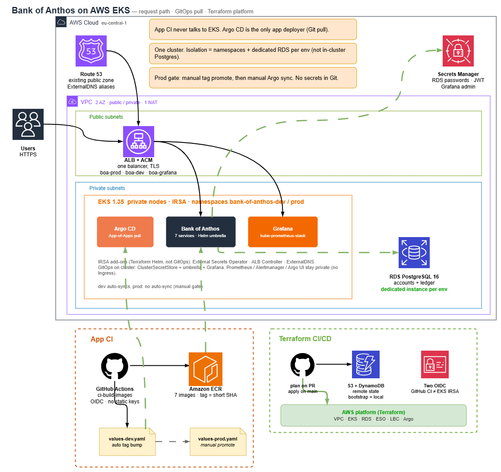
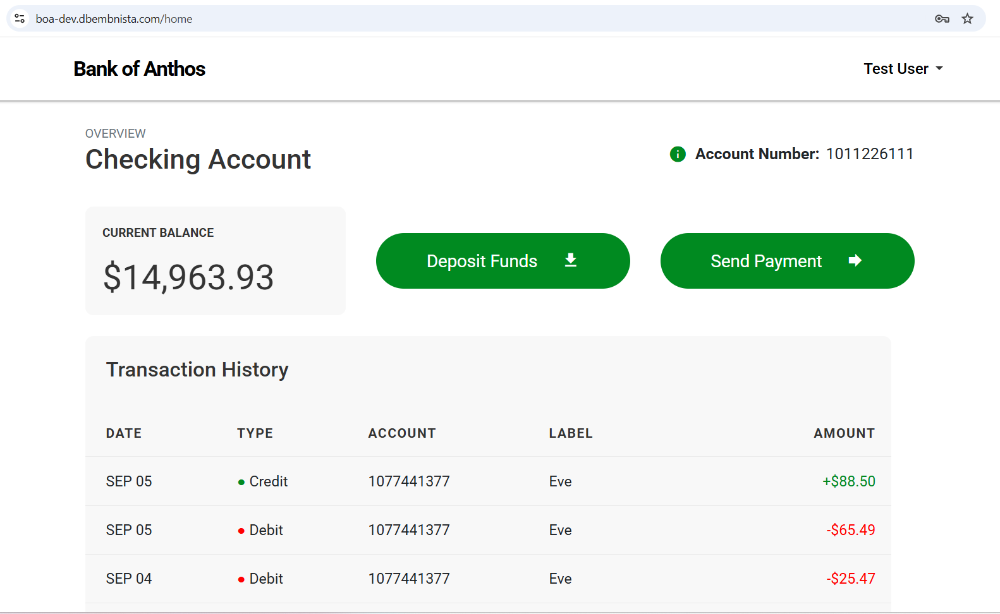
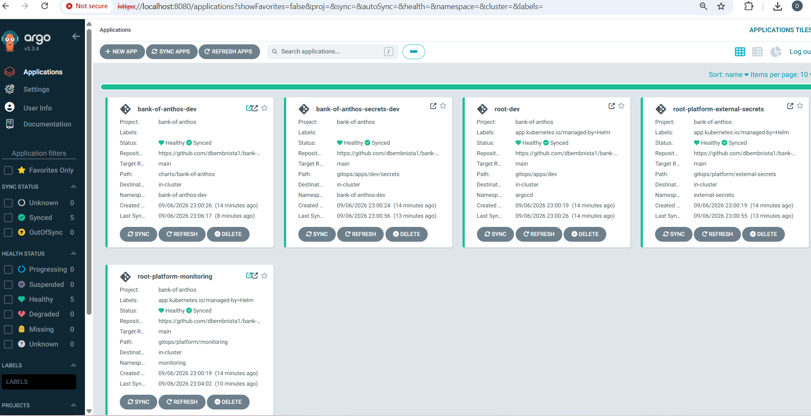
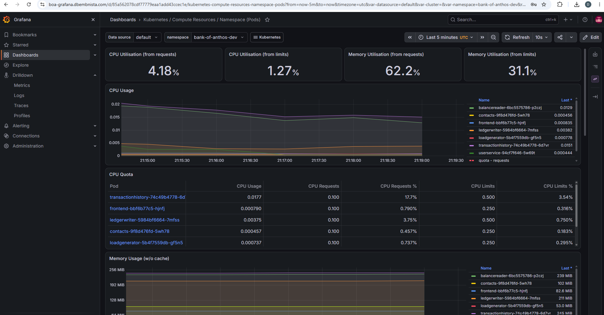
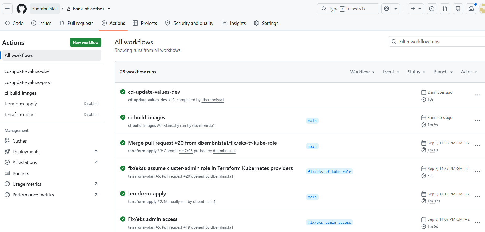

# Bank of Anthos on AWS EKS

GitOps deployment of [Google's Bank of Anthos](https://github.com/GoogleCloudPlatform/bank-of-anthos) on a shared Amazon EKS cluster.

Infrastructure is Terraform. Images are built in GitHub Actions (OIDC → ECR). **Only Argo CD** deploys the application. Terraform CI/CD applies the platform (`terraform/`).

Stack: AWS, Terraform, EKS, Helm, Argo CD, External Secrets, ALB. Not a fork of the upstream GKE manifests.

Optional TLS on an existing Route 53 zone, e.g. **boa-dev.dbembnista.com** (app) and **boa-grafana.dbembnista.com** (Grafana). 

## Architecture

One VPC and one EKS cluster. `dev` / `prod` are Kubernetes namespaces plus **dedicated** RDS instances — databases are never shared across environments, and never run in the cluster.

Public UI shares one internet-facing ALB (TLS, ACM wildcard, ExternalDNS → Route 53). Argo CD stays ClusterIP (port-forward). Prometheus and Alertmanager are not exposed.



| Layer | Choice |
|---|---|
| Network | Custom VPC, 2 AZs, public + private subnets, single NAT (lab cost) |
| Cluster | EKS 1.35, managed node group in **private** subnets, IRSA enabled. VPC is first-party; EKS is a thin wrapper around `terraform-aws-modules/eks` |
| Data | Amazon RDS PostgreSQL 16 — accounts + ledger **per enabled env** |
| Secrets | Secrets Manager → External Secrets Operator → Kubernetes Secrets |
| Ingress | AWS Load Balancer Controller (Helm + IRSA). With `ingress_domain`: one ALB, ACM, ExternalDNS. Empty domain: lab HTTP ALB per Ingress |
| Observability | kube-prometheus-stack via GitOps. Grafana on the shared ALB when a domain is set; Prometheus/Alertmanager stay private |
| App packaging | Helm umbrella (`charts/bank-of-anthos`) |
| GitOps | Argo CD (Helm via Terraform) + App-of-Apps |
| Images | ECR; tag = git short SHA |

## Screenshots

While the lab is up (infra is destroyed outside demos):

| Frontend | Argo CD |
|---|---|
|  |  |
| **Grafana** | **GitHub Actions** |
|  |  |

## Decisions

| Decision | Why |
|---|---|
| RDS, not in-cluster Postgres | Upstream DB pods are a demo convenience. On EKS you own backups, failover, and disk. RDS is managed, reachable only from the node SG; schema is seeded by Helm Jobs. |
| One cluster, two environments | A second EKS (and NAT) roughly doubles lab cost. Namespaces plus **dedicated** RDS keep data from mixing; `enabled_environments` defaults to `["dev"]` so prod is a spend switch, not a second VPC. |
| Bootstrap is local; `terraform/` is remote | GitHub Actions cannot create the OIDC role and state bucket it would need to apply `bootstrap/` (chicken and egg). That directory runs once from a laptop. |
| App CI never talks to EKS | A build workflow should not hold `kubectl`. If those credentials leak, the blast radius is ECR and a Git commit, not the cluster. Argo **pulls**. Terraform apply may talk to EKS only as platform IaC (Argo, ESO, ALB Controller). |
| Prod is a manual gate | Auto-sync after every green build is how a lab quietly “promotes.” Tags go to `values-prod.yaml` only via `workflow_dispatch`; prod Applications have no auto-sync. |
| Two OIDC providers | GitHub’s issuer and EKS IRSA are different trust domains. One IAM role for both would let a compromised workflow use ESO’s path to Secrets Manager (or the ALB Controller). |
| Secrets Manager for credentials | SM is built to rotate RDS passwords, JWT, and Grafana admin. Git only stores ExternalSecret CRs (how to fetch), not the payload. |
| Spend is a switch, not a surprise | Two public UIs without a shared ALB are two balancers. No Cluster Autoscaler; `desired_size` is ignored after create. A `t3.medium` holds ~17 pods — `dev` + `prod` HA does not fit on two nodes, so scale-out is a conscious `update-nodegroup-config`. |

## Repository layout

```
bootstrap/                 # One-shot: S3 state, DynamoDB lock, GitHub OIDC (local state)
terraform/                 # VPC, EKS, ECR, RDS, add-ons, Argo CD (remote state)
  modules/{vpc,eks,ecr,rds,external-secrets,
           aws-load-balancer-controller,ingress-dns,external-dns,argocd-bootstrap}
charts/bank-of-anthos/     # Umbrella chart + values-dev.yaml / values-prod.yaml
gitops/
  apps/{dev,prod}/         # Argo Applications + ExternalSecrets
  platform/                # ClusterSecretStore + kube-prometheus-stack
src/                       # Vendored BoA snapshot for image builds (no upstream sync)
.github/workflows/         # App images + tag promote; Terraform plan/apply
scripts/                   # bootstrap-jwt.ps1, bootstrap-grafana.ps1
docs/                      # deploy.md, operations.md, architecture PNG, screenshots/
```

Application source is a snapshot of [Bank of Anthos](https://github.com/GoogleCloudPlatform/bank-of-anthos) (`1e40564`, Apache 2.0). In-cluster DB images and `ledgermonolith` are omitted on purpose.

## Deploy (outline)

Prerequisites: AWS CLI, Terraform >= 1.5, kubectl, Helm, PowerShell. Region in examples is `eu-central-1`. Knobs live in committed `terraform/terraform.tfvars` (no secrets). Forks start from `terraform.tfvars.example`.

1. **Bootstrap (once)** — `bootstrap/`: copy `terraform.tfvars.example`, set `TF_VAR_github_token`, `terraform apply`. Creates the state bucket, lock table, and GitHub OIDC role. Copy outputs into `terraform/backend.conf` (gitignored).
2. **Platform** — `terraform/`: `terraform init -backend-config=backend.conf`, set `TF_VAR_argocd_gh_token`, `terraform apply`. Shared VPC/EKS/ECR always; RDS + Argo root Apps follow `enabled_environments`. Public TLS needs an existing Route 53 zone and `ingress_domain`.
3. **Secrets** — `.\scripts\bootstrap-jwt.ps1` and `.\scripts\bootstrap-grafana.ps1` (ESO syncs `jwt-key` and Grafana admin).
4. **Images** — push to `main` under `src/**` (or run `ci-build-images` / `cd-update-values-dev` by hand). Argo auto-syncs **dev**. Seed Jobs must succeed before Java ledger pods become Ready.
5. **Prod** — set `enabled_environments = ["dev", "prod"]` and apply; run `cd-update-values-prod`; **Sync** `bank-of-anthos-prod` in Argo CD.


Without `ingress_domain`, frontend and Grafana are port-forward only (`svc/frontend` in `bank-of-anthos-dev`, Grafana in `monitoring`).

Full walkthrough (PowerShell, kubeconfig `--role-arn`, tear-down): [docs/deploy.md](docs/deploy.md). Day-2 (scale nodes, promote, pod limits, Terraform CI/CD): [docs/operations.md](docs/operations.md).

## CI / CD

```
src change on main
  -> ci-build-images (OIDC -> ECR, tag = short SHA)
  -> cd-update-values-dev (bot commit on values-dev.yaml)
  -> Argo CD auto-syncs bank-of-anthos-dev

promote
  -> cd-update-values-prod (workflow_dispatch)
  -> Argo CD manual sync of bank-of-anthos-prod

terraform/** PR
  -> terraform-plan (fmt / validate / plan, PR comment)

terraform/** merge to main
  -> terraform-apply (GitHub Environment infra)
```

`global.imageRegistry`, RDS hosts, and Ingress host/cert are **not** in the values overlays. Terraform passes them into the root App-of-Apps as Helm parameters. App workflows have no cluster credentials. Disable `terraform-apply` in the Actions UI when the lab should not apply itself.

## License

Infrastructure and GitOps in this repository: use as a portfolio reference.

Application code under `src/`: Apache License 2.0, [GoogleCloudPlatform/bank-of-anthos](https://github.com/GoogleCloudPlatform/bank-of-anthos).
